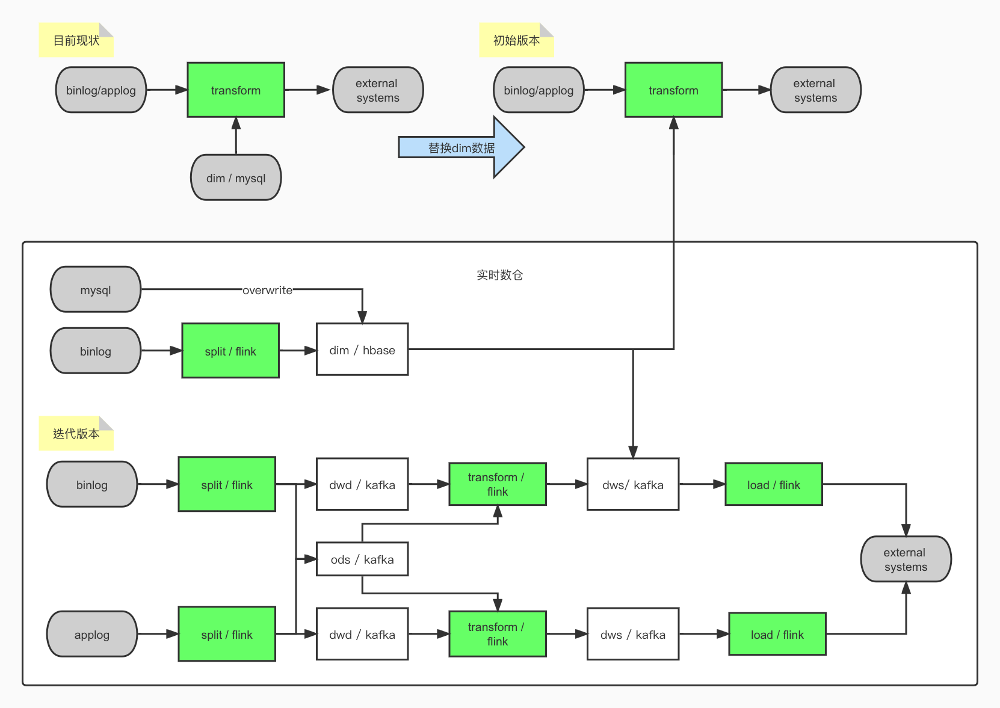
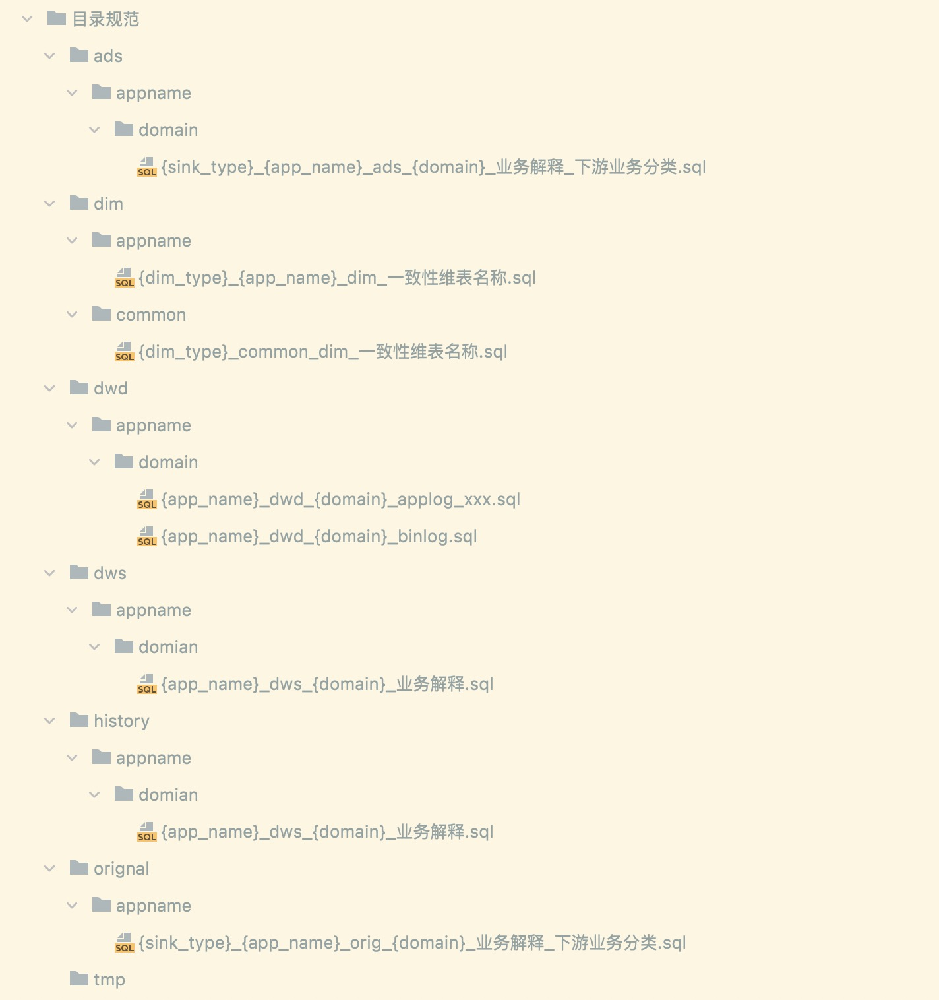

# inke_gz

## 数据流


## 目前现状
1. 平台能力欠缺
2. 数据开发，数仓建设等缺少规范约束

### 完善建议
* 元数据平台
	1. 项目空间，个人空间（解决项目与个人权限问题）
	2. 不同路径下文件夹或文件名称重名无法创建问题
	3. 文件版本管理
	4. flink-jar形式提交作业
	5. flink-udf管理
	6. flink版本选择功能，目前底层基于dtstack-flink1.10
* 其他
	1. hdfs路径checkpoint（hdfs:///user/streamsql/job_name/）
	2. 后续提供rocksdb支持，支持大状态作业
	3. 完善现有监控，kafka-lag，作业失败等
	4. kafka专有集群或topic删减权限（免去增删topic流程）
	5.   kafka数据预览


### 相关链接
```text
https://datalabemr.inkept.cn/meta_data.html#/streamSQL/dataDevelop 元数据国内
https://sg-datalab.inkept.cn/meta_data.html#/streamSQL/dataDevelop 元数据海外
http://kafka-manager-read.dsj.inkept.cn:8080/clusters/emr-kafka/topics  kafka管理
http://emr-header-2.cluster-203106:8088/cluster                    yarn国内
http://10.226.109.16:5004/cluster                                  yarn海外

https://wiki.inkept.cn/pages/viewpage.action?pageId=119209884       stramFlinkSQL文档（跟官网差不多）
https://github.com/DTStack/flinkStreamSQL                          袋鼠云
https://code.inke.cn/tanweiquan/flink-udf                          新开发-自定义UDF
https://code.inke.cn/bigdata/bigdata-service/streamsqludf          现有udf（北京）
https://wiki.inkept.cn/pages/viewpage.action?pageId=106869599      
https://code.inke.cn/tpc/bigdata/bigdata-service/flink-demo        flink脚手架（北京）
```

## 实时数仓

### 1. 数仓目录文件规范

常用名词解释  

[广分数仓项目信息](https://wiki.inkept.cn/pages/viewpage.action?pageId=211473366)

|缩写标识	|sinktype	|
|----  	|---- 	|
|kfk	|kafka 		|
|cs	|console 		|
|es	|elasticsearch	|
|ck	|clickhouse 	|
|hb	|hbase		|

|名词		|解释			|
|----  	|---- 		|
|wide	|统一宽表定义	|

|名词		|下游业务类型	|
|----  	|---- 		|
|olap		|分析运营		|
|algo		|算法			|
|app		|应用			|


#### 1.1 目录规范  

* 使用全局共用目录进行代码管理（或使用gitlab进行管理），该路径下只存放生产相关作业脚本文件  
* 个人目录用于户个人测试开发，无规范约束
 
```text

global
	original  初始作业层
		common      【公共作业】
		app_name    【应用名称】
			domain  【业务域/主题】
	dwd      数据明细层
	dws      数据汇总层
	ads      数据应用层
	dim      维表层
	history  重要历史记录
	tmp      临时短期任务
```

整体示例


#### 1.2 目录解释与文件命名规范

* 目录结构解释   

```text
一级目录：
	目录名按实时数仓分层或功能区分定义
二级目录：
	appname目录，存放对应app脚本
	common目录，存放多app公用脚本
三级目录：
	domain目录，根据业务域，主题划分命名。如：user用户域
```

* kafka相关规则

若埋点客户端数据上报正常的话，topic的查询方式是以下规则：  

```
1. batch 对应的topic ${app_key}_applog_batch
2. click、visit、basic对应的topic ${app_key}_applog_common
3. quality 对应的topic ${app_key}_applog_quality
4. action 对应的topic ${app_key}_applog_action
5. other 对应的topic ${app_key}_applog_other
```

[映客kafka信息](https://wiki.inkept.cn/pages/viewpage.action?pageId=69308124)  

```text
根据以上链接约定消费者group命名规则:
dwd/orgi : cop.inke_owt.data_pdl.{appname}_ods_{log_type}_{env}
dws/ads : cop.inke_owt.data_pdl.{tablename}_{env}
log_type : binlog,applog,serverlog
env：dev,prod
如：
1. cop.inke_owt.data_pdl.{tablename}_dev-gz_group
2. cop.inke_owt.data_pdl.{tablename}_prod-gz_group

生产者topic命名规则：
同实时数仓表名一致
```

* original【初始作业层】

```text
存放单作业完成整个链路逻辑的脚本，即binlog或埋点数据为输入，业务结果数据为输出的作业
1. 用于迁移现有版本作业（现有历史作业均为单作业）
2. 新项目头几个需求作业，未存在数据复用情况，无法进行分层
3. 离线暂无相关模型作业

脚本命名：
{sink_type}_{app_name}_original_{domain}_业务解释_下游业务分类
例：es_readom_orig_user_wide_olap
```

* dwd【数据明细层】

```text
存放数据明细层脚本，主要用与做数据分流，数据清洗过滤
根据kfk输入topic+业务域为同一个分流作业

脚本命名：
{app_name}_dwd_{domain}_binlog
{app_name}_dwd_{domain}_applog_xxx 【xxx参考客户端埋点规则】
例：readom_dwd_user_binlog,readom_dwd_user_applog_action
```

* dws【数据明细层】

```text
存放数据汇总层脚本，根据不同业务域进行宽表构建，此层开始出现窗口聚合
根据dwd分流数据进行合并，关联维表层数据聚合计算

脚本命名：
{app_name}_dws_{domain}_业务解释
例：readom_dws_user_wide
```

* ads【数据应用层】

```text
存放数据应用层脚本，根据业务需求进行指标维度筛选，进行推送

脚本命名：
{sink_type}_{app_name}_ads_{domain}_业务解释_下游业务分类
例：kafka_readom_ads_userprofile_recall_algo
```

* dim【维表层】

```text
存放维表脚本

脚本命名：
{dim_type}_{app_name}_dim_一致性维表名称
dim_type，维表类型：hb,mysql,redis等
例：hb_readom_dim_book
```

* history【历史作业】

```text
存放历史下线作业脚本
将其他数仓目录中脚本迁移到此目录归档
```

### 2. 代码规范

#### 2.1 注释

```text
/*
目标表名
FROM:
	数据来源描述
	1. dwd/orgi		:【表名:事件名称】
	2. dws/ads		:【表名】
	3. dim			:【数据库类型:业务库信息#表名】
TO:
	数据去向描述
	1. orgi/ads		:【数据库类型:业务库信息(kafka信息)#表名(topic)】
	2. dwd/dws/dim	:【目标表名】
    
VERSION:
	yyyyMMdd日期 姓名 业务描述:wiki
	yyyyMMdd日期 姓名 修改内容
*/
```
示例

```text
kfk_readom_orginal_userprofile_recall_algo.sql
/*
kfk_readom_ads_userprofile_recall
FROM:
-- readom_ods_binlog:chapter_buy_record
-- readom_ods_applog_action:readom_app_reading_time
-- readom_ods_applog_common:readom_app_add_book,readom_app_readguide_collect
TO:
-- kfk:singapore-kafka#middle_rec_real_user_profile_attrsync
    
VERSION:
-- 20220621 tanweiquan 用户画像-实时召回:https://wiki.inkept.cn/pages/viewpage.action?pageId=251175206
*/
```

#### 2.2 表命名

```text
ods:	{apppname}_ods_(log_type}  如readom_ods_applog_common
dwd:	{app_name}_dwd_{domain}_业务解释(eid)
dws:	{app_name}_dws_{domain}_业务解释(wide)
ads:	{sink_type}_{app_name}_ads_{domain}_业务解释(wide)
dim:	{dim_type}_{app_name}_dim_一致性维表名称
```

[具体示例](https://sg-datalab.inkept.cn/meta_data.html#/dataManagement/streamSQL/dataDevelop)


#### 2.3 作业命名

作业名与文件名保持一致