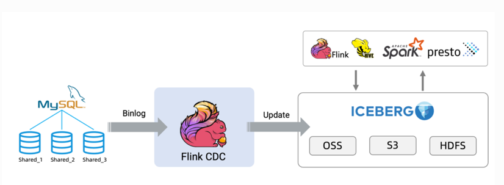

# inke_gz【实时数仓】

## 目前现状
1. 平台能力欠缺
2. 数据开发，数仓建设等缺少规范约束
3. 需求到验收，缺少完成流程形成闭环

### 完善建议
* 元数据平台
  1. 项目空间，个人空间（项目与个人权限问题）
  2. 不同路径下文件夹或文件名称重名无法创建问题
  3. 文件版本管理
  4. flink-jar形式提交作业
  5. flink-udf管理
  6. flink版本选择功能，目前底层基于dtstack-flink1.10
  7. 小问题：搜索功能无法定位具体作业，作业参数无法正常保存，切换标签页代码未保存会重置
* 其他
  1. 后续提供rocksdb支持，支持大状态作业( checkpoint`[hdfs:///user/streamsql/job_name]` )
  2. 完善现有监控，kafka（Grafana+prometheus），作业失败（短信电话）等
  3. kafka专有集群或topic删减权限（免去增删topic流程）
  4. kafka数据预览
  5. 跳板机权限问题（使用fllink-jar形式提交，个人用户无法正常提交）
  6. 数据查询无法保存sql


### 相关链接
```text
https://datalabemr.inkept.cn/meta_data.html#/streamSQL/dataDevelop          元数据国内
https://sg-datalab.inkept.cn/meta_data.html#/streamSQL/dataDevelop          元数据海外
http://kafka-manager-read.dsj.inkept.cn:8080/clusters/emr-kafka/topics      kafka管理
http://emr-header-2.cluster-203106:8088/cluster                             yarn国内
http://10.226.109.16:5004/cluster（dns:192.168.0.5）                         yarn海外

https://wiki.inkept.cn/pages/viewpage.action?pageId=119209884               streamFlinkSQL文档（跟官网差不多）
https://github.com/DTStack/flinkStreamSQL                                   袋鼠云
https://code.inke.cn/bigdata/bigdata-service/streamsqludf                   现有udf（北京）
https://wiki.inkept.cn/pages/viewpage.action?pageId=106869599      
https://code.inke.cn/tpc/bigdata/bigdata-service/flink-demo                 flink脚手架（北京，参考）

https://code.inke.cn/tanweiquan/flink-udf                                   新开发-自定义UDF
https://code.inke.cn/tanweiquan/flink_inke_gz                               新开发-存放flink-jar，跳板机提交作业
```

## 开发规范

数据流


湖仓一体  


### 1. 数仓目录文件规范

常用名词解释  

[广分数仓项目信息](https://wiki.inkept.cn/pages/viewpage.action?pageId=211473366)

|缩写标识	|sinktype	|
|----  	|---- 	|
|kfk	|kafka 		|
|cs	|console 		|
|es	|elasticsearch	|
|ck	|clickhouse 	|
|hb	|hbase		|

|名词		|解释			|
|----  	|---- 		|
|wide	|统一宽表定义	|

|名词		|下游业务类型	|
|----  	|---- 		|
|olap		|分析运营		|
|algo		|算法			|
|app		|应用			|


#### 1.1 目录规范  

* 使用全局共用目录进行代码管理（或使用gitlab进行管理），该路径下只存放生产相关作业脚本文件  
* 个人目录用于户个人测试开发，无规范约束
 
```text

global
	original  初始作业层
		common      【公共作业】
		app_name    【应用名称】
			domain  【业务域/主题】
	dwd      数据明细层
	dws      数据汇总层
	ads      数据应用层
	dim      维表层
	history  重要历史记录
	tmp      临时短期任务
```

整体示例


#### 1.2 目录解释

* 目录结构解释   

```text
一级目录：
	目录名按实时数仓分层或功能区分定义
二级目录：
	appname目录，存放对应app脚本
	common目录，存放多app公用脚本
三级目录：
	domain目录，根据业务域，主题划分命名。如：user用户域
```

#### 1.3 Kafka命名规范
* 业务侧上报，kafka数据相关规则

若埋点客户端数据上报正常的话，topic的查询方式是以下规则：  

```
1. batch 对应的topic ${app_key}_applog_batch
2. click、visit、basic对应的topic ${app_key}_applog_common
3. quality 对应的topic ${app_key}_applog_quality
4. action 对应的topic ${app_key}_applog_action
5. other 对应的topic ${app_key}_applog_other
```

[映客kafka信息](https://wiki.inkept.cn/pages/viewpage.action?pageId=69308124)  

* 业务侧上报，kafka数据相关规则

```text
根据以上链接约定消费者group命名规则:
-- 广州 cop.inke_owt.inno_pdl
dwd : cop.inke_owt.inno_pdl.{appname}_ods_{log_type}_{env}
orgi/dws/ads : cop.inke_owt.inno_pdl.{tablename}_{env}
log_type : binlog,applog,serverlog
env：dev,prod
如：
1. cop.inke_owt.inno_pdl.{tablename}_dev
2. cop.inke_owt.inno_pdl.{tablename}_prod

生产者topic命名规则：
同实时数仓表名一致
```

#### 1.4 文件命名规范
* original【初始作业层】

```text
存放单作业完成整个链路逻辑的脚本，即binlog或埋点数据为输入，业务结果数据为输出的作业
1. 用于迁移现有版本作业（现有历史作业均为单作业）
2. 新项目头几个需求作业，未存在数据复用情况，无法进行分层
3. 离线暂无相关模型作业

脚本命名：
{sink_type}_{app_name}_original_{domain}_业务解释_下游业务分类
例：es_readom_orig_user_wide_olap
```

* dwd【数据明细层】

```text
存放数据明细层脚本，主要用与做数据分流，数据清洗过滤
根据kfk输入topic+业务域为同一个分流作业

脚本命名：
{app_name}_dwd_{domain}_binlog
{app_name}_dwd_{domain}_applog_xxx 【xxx参考客户端埋点规则】
例：readom_dwd_user_binlog,readom_dwd_user_applog_action
```

* dws【数据明细层】

```text
存放数据汇总层脚本，根据不同业务域进行宽表构建，此层开始出现窗口聚合
根据dwd分流数据进行合并，关联维表层数据聚合计算

脚本命名：
{app_name}_dws_{domain}_业务解释
例：readom_dws_user_wide
```

* ads【数据应用层】

```text
存放数据应用层脚本，根据业务需求进行指标维度筛选，进行推送

脚本命名：
{sink_type}_{app_name}_ads_{domain}_业务解释_下游业务分类
例：kafka_readom_ads_userprofile_recall_algo
```

* dim【维表层】

```text
存放维表脚本
明确维表使用，存储组件，维表更新策略

脚本命名：
{dim_type}_{app_name}_dim_一致性维表名称
dim_type，维表类型：hb,mysql,redis等
例：hb_readom_dim_book
```

* history【历史作业】

```text
存放历史下线作业脚本，命名规范与原来脚本所在层级一致
将其他数仓目录中脚本迁移到此目录归档
```

### 2. 代码规范

#### 2.1 注释

```text
/*
目标表名
FROM:
	数据来源描述
	1. dwd/orgi		:【表名:事件名称】
	2. dws/ads		:【表名】
	3. dim			:【数据库类型:业务库信息#表名】
TO:
	数据去向描述
   【数据库类型:业务库信息(kafka信息)#目标表名(topic)】
    
VERSION:
	yyyyMMdd日期 姓名 业务描述:wiki
	yyyyMMdd日期 姓名 修改内容
*/
```
示例

```text
kfk_readom_orginal_userprofile_recall_algo.sql
/*
kfk_readom_ads_userprofile_recall
FROM:
    readom_ods_binlog:chapter_buy_record
    readom_ods_applog_action:readom_app_reading_time
    readom_ods_applog_common:readom_app_add_book,readom_app_readguide_collect
TO:
    kfk:singapore-kafka#middle_rec_real_user_profile_attrsync
    
VERSION:
    20220621 tanweiquan 用户画像-实时召回:https://wiki.inkept.cn/pages/viewpage.action?pageId=251175206
*/
```

#### 2.2 表命名

```text
ods:	{apppname}_ods_(log_type}  如readom_ods_applog_common
dwd:	{app_name}_dwd_{domain}_业务解释(eid)
dws:	{app_name}_dws_{domain}_业务解释(wide)
ads:	{sink_type}_{app_name}_ads_{domain}_业务解释(wide)
dim:	{dim_type}_{app_name}_dim_一致性维表名称
```

示例: ```kfk_readom_ads_userprofile_recall_algo.sql```

```sql
/*
kfk_readom_ads_userprofile_recall
FROM:
-- readom_ods_binlog:chapter_buy_record
-- readom_ods_applog_action:readom_app_reading_time
-- readom_ods_applog_common:readom_app_add_book,readom_app_readguide_collect
TO:
-- kfk:singapore-kafka#middle_rec_real_user_profile_attrsync
    
VERSION:
-- 20220621 tanweiquan 用户画像-实时召回:https://wiki.inkept.cn/pages/viewpage.action?pageId=251175206
*/


create AGGREGATE function CollectSet2Str with udf.CollectSet2StrFunction;

CREATE TABLE readom_ods_binlog
(
	time            timestamp   as rtime,
	topic           varchar,
	data.uid        varchar     as uid,
	data.novel_id   varchar     as novel_id,
	data.status     varchar     as status,
	WATERMARK FOR rtime as withOffset(rtime, 2000)
) with (
      type = 'kafka11',
      bootstrapServers = 'kafka01.dsj.sg.inkept.cn:9092,kafka02.dsj.sg.inkept.cn:9092,kafka03.dsj.sg.inkept.cn:9092',
      offsetReset = 'latest',
      topic = 'app_readom_binlog',
      parallelism = '4',
      groupId = 'cop.inke_owt.data_pdl.readom_ads_userprofile_recall_prod',
      topicIsPattern = 'false',
      startupMode = 'GROUP_OFFSETS',
      logText = 'log_json'
      );

CREATE TABLE readom_ods_applog_action
(
	md_eid                   varchar,
	uid                      varchar,
	md_einfo.novel_id        varchar         as novel_id,
	md_einfo.readduring      bigint          as readduring, -- 毫秒
	record_time              bigint,
	WATERMARK FOR record_time as withOffset(record_time, 2000)
) with (
      type = 'kafka11',
      bootstrapServers = 'kafka01.dsj.sg.inkept.cn:9092,kafka02.dsj.sg.inkept.cn:9092,kafka03.dsj.sg.inkept.cn:9092',
      offsetReset = 'latest',
      topic = 'readom_applog_action',
      parallelism = '4',
      groupId = 'cop.inke_owt.data_pdl.readom_ads_userprofile_recall_prod',
      topicIsPattern = 'false',
      startupMode = 'GROUP_OFFSETS',
      logText = 'log_json'
      );

CREATE TABLE readom_ods_applog_common
(
	md_eid                   varchar,
	uid                      varchar,
	md_einfo.novelid         varchar     as novelid,    -- readom_app_add_book
	md_einfo.novel_id        varchar     as novel_id,   -- readom_app_readguide_collect
	record_time              bigint,
	WATERMARK FOR record_time as withOffset(record_time, 2000)
) with (
      type = 'kafka11',
      bootstrapServers = 'kafka01.dsj.sg.inkept.cn:9092,kafka02.dsj.sg.inkept.cn:9092,kafka03.dsj.sg.inkept.cn:9092',
      offsetReset = 'latest',
      topic = 'readom_applog_common',
      parallelism = '2',
      groupId = 'cop.inke_owt.data_pdl.readom_ads_userprofile_recall_prod',
      topicIsPattern = 'false',
      startupMode = 'GROUP_OFFSETS',
      logText = 'log_json'
      );

create table cs_readom_ads_userprofile_recall
(
    _version  	        int,
    _source   	        varchar,
    _app      	        varchar,
    _version_type       varchar,
    _id                 varchar,
    _time               varchar,
    u_prefer_item_h     varchar
) with (
      type = 'console',
      parallelism = '1'
      );

create table kfk_readom_ads_userprofile_recall
(
    _version            int,
    _source   	        varchar,
    _app      	        varchar,
    _version_type       varchar,
    _id                 varchar,
    _time               varchar,
    u_prefer_item_h     varchar
) with (
    type = 'kafka11',
    bootstrapServers = 'kafka01.dsj.sg.inkept.cn:9092,kafka02.dsj.sg.inkept.cn:9092,kafka03.dsj.sg.inkept.cn:9092',
    -- zookeeperQuorum = 'zk01.dsj.sg.inkept.cn:2181,zk02.dsj.sg.inkept.cn:2181,zk03.dsj.sg.inkept.cn:2181'
    topic='middle_rec_real_user_profile_attrsync',
    parallelism ='5',
    topicIsPattern ='false',
    updateMode='upsert'
 );

CREATE view v_readom_ads_userprofile_recall as
select 2                               		_version
      , 'kfk_readom_ads_profile_recall'		_source
 	  , 'readom'                       		_app
      , 'userprofile'                  		_version_type
	  , uid                            		_id
      , ts_end                         		_time
      , CollectSet2Str(item)           		u_prefer_item_h
from (
       select uid
              , date_format(ts_end, 'yyyyMMddHHmmss')                     ts_end
              , concat_ws(':', novel_id, cast(score as varchar))          item
              , row_number() over (partition by uid order by score desc ) row_num
       from (select uid
                    , novel_id
                    , sum(buy_score)
                 + case
                       when sum(readduring) > 0 and sum(readduring) <= 60 * 1000 then 1
                       when sum(readduring) > 60 * 1000 and sum(readduring) <= 7 * 60 * 1000 then 2
                       when sum(readduring) > 7 * 60 * 1000 and sum(readduring) <= 60 * 60 * 1000 then 4
                       when sum(readduring) > 60 * 60 * 1000 then 10
                       else 0
                          end
                 + max(collect_score) * 4                                        score
                    , HOP_START(ROWTIME, INTERVAL '1' MINUTE, INTERVAL '5' HOUR) ts_start
                    , HOP_END(ROWTIME, INTERVAL '1' MINUTE, INTERVAL '5' HOUR)   ts_end
               from (
                        select uid
                             , novel_id
                             , 0  readduring
                             , 10 buy_score
                             , 0  collect_score
                             , ROWTIME
                        from readom_ods_binlog
                        where topic = 'chapter_buy_record' -- 付费
                          and status = '2'                 -- 支付成功
                          and uid is not null
                          and novel_id is not null

                        union all

                        select uid
                             , novel_id
                             , readduring
                             , 0 buy_score
                             , 0 collect_score
                             , ROWTIME
                        from readom_ods_applog_action
                        where md_eid = 'readom_app_reading_time' -- 阅读时长
                          and uid is not null
                          and novel_id is not null

                        union all

                        select uid
                             , COALESCE(novel_id, novelid) novel_id
                             , 0                           readduring
                             , 0                           buy_score
                             , 1                           collect_score
                             , ROWTIME
                        from readom_ods_applog_common
                        where md_eid in ('readom_app_add_book', 'readom_app_readguide_collect') -- 收藏
                          and uid is not null
                          and COALESCE(novel_id, novelid) is not null
                    ) t
               group by HOP(ROWTIME, INTERVAL '1' MINUTE, INTERVAL '5' HOUR), uid, novel_id
              ) tt
     ) ttt
where row_num <= 20
group by uid
       , ts_end
;

insert
into kfk_readom_ads_userprofile_recall
select 
 	_version  	
   ,_source   	
   ,_app      	
   ,_version_type  
   ,_id            
   ,_time          
   ,u_prefer_item_h   
   from v_readom_ads_userprofile_recall;

insert
into cs_readom_ads_userprofile_recall
select 
 	_version  	
   ,_source   	
   ,_app      	
   ,_version_type  
   ,_id            
   ,_time          
   ,u_prefer_item_h   
   from v_readom_ads_userprofile_recall
 ;
```

#### 2.3 作业命名

作业名与文件名保持一致

## 数据模型，主数据，指标数据
## 运维&问题排查